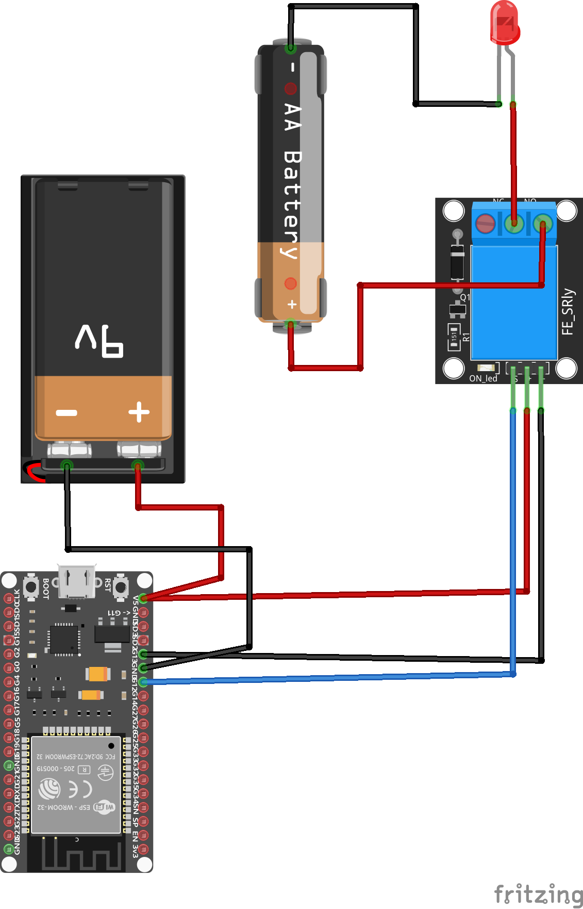
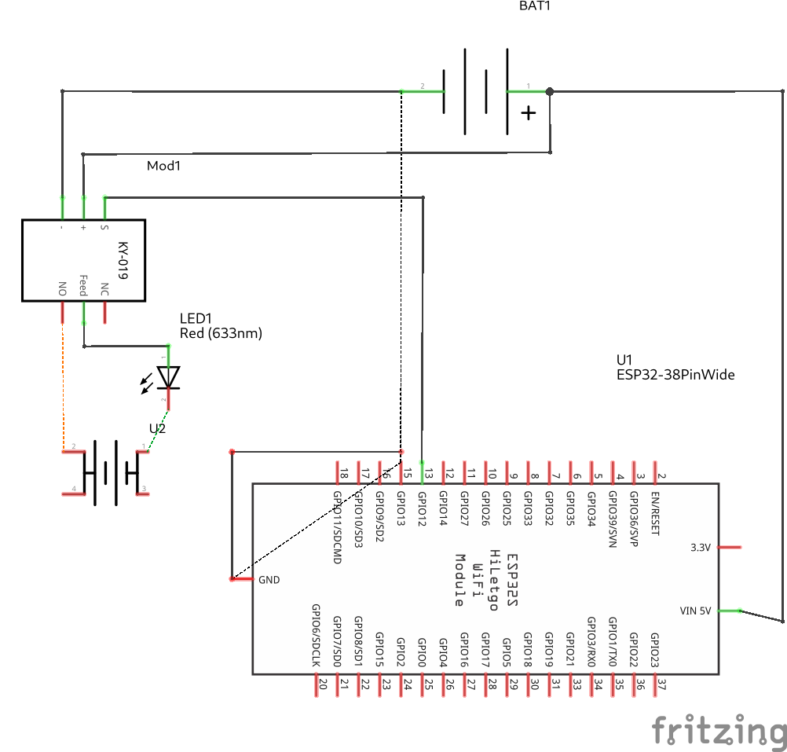
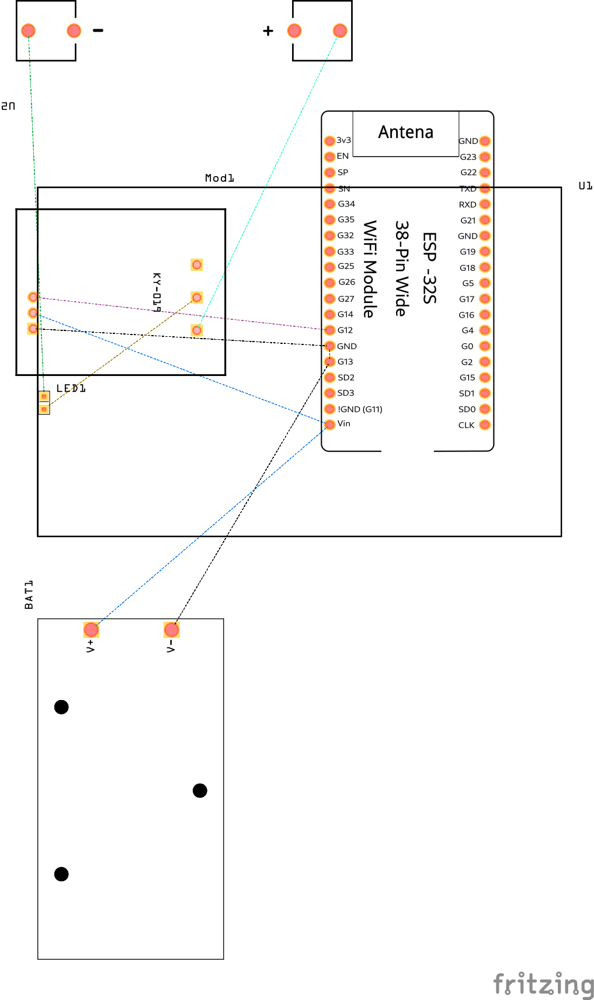

# Alarma-Max

Codigo de `ESP32` para poder conectarse a `Firebase` con la librearía `Firebase_ESP_Client`.

Este proyecto busca encender una sirena, o cualquier otro dispositivo a través de Firebase.

## Librerias de Arduino
 - Firebase_ESP_Client (4.4.12 by mobizt)
 - ArduinoJson (0.2 by Benoit)

## Prototipo (Imagen)
> Las fuentes de poder son solo ejemplo.

### Materiales
 - ESP32
 - Modulo RELAY 12V
 - Fuente de alimentación 5V (ESP32)
 - Fuente de alimentación 12V (Sirena)

## Esquema (Imagen)

## PCB (Imagen)
